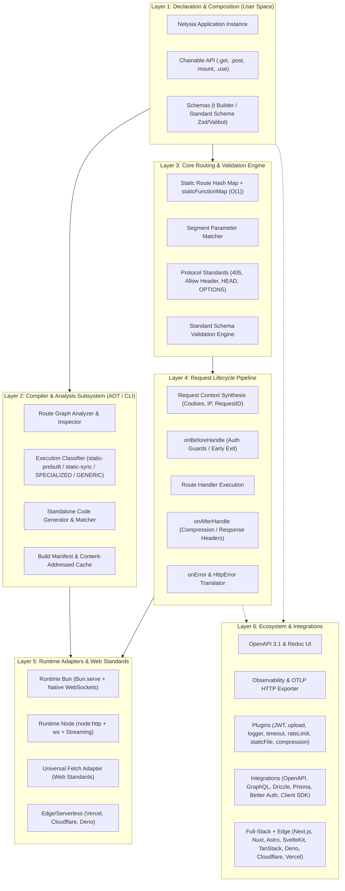
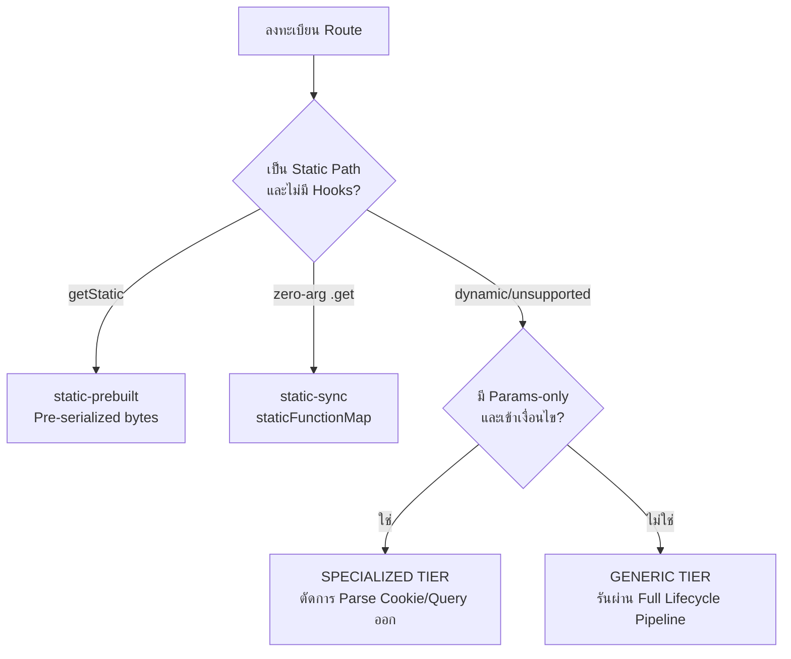
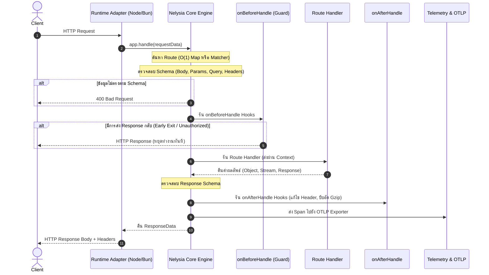

# Nelysia: System Architecture Blueprint

เอกสารสรุปสถาปัตยกรรมระบบของ **Nelysia (Compiler-First TypeScript Backend Framework)**

---

## 1. ภาพรวมสถาปัตยกรรมระดับสูง (High-Level Architecture)

Nelysia ถูกออกแบบโดยแบ่งความรับผิดชอบออกเป็น **6 เลเยอร์หลัก (Layered Architecture)** เพื่อแยกส่วนการประกาศ (Declaration), การวิเคราะห์ตอนคอมไพล์ (Compile-time Analysis), การประมวลผลคำขอ (Runtime Core), และการเชื่อมต่อกับรันไทม์ต่างๆ (Runtime Adapters):



---

## 2. เจาะลึกแต่ละเลเยอร์ (Detailed Layer Breakdown)

### Layer 1: Declaration & Composition Layer (เลเยอร์การประกาศคำสั่ง)
เลเยอร์สำหรับนักพัฒนาในการประกอบแอปพลิเคชัน:
* **`Nelysia` Instance:** จัดเก็บสถานะส่วนกลาง เช่น `bodyLimit` (ค่าเริ่มต้น 1 MB), `trustedProxy`, `secureCookies` และ `RouteGraph`
* **Route Graph Accumulator:** เก็บข้อมูลการลงทะเบียน Route ไว้ในรูปแบบ Immutable Records เพื่อส่งต่อให้ Engine และ Compiler
* **Sub-App Composition (`mount`):** รวมแอปย่อยด้วย Path Prefix โดยจัดระเบียบ Namespace และคัดลอก Route Metadata อย่างสมบูรณ์
* **Plugin Mechanism (`use`):** Functional Plugin Interface ที่ช่วยแยกส่วนขยายการทำงาน เช่น Rate Limit หรือ CORS ออกเป็นโมดูลอิสระ

#### Feature Module Convention

Nelysia treats a feature module as a `Nelysia` instance. The instance owns the feature's routes, schemas, policies, and lifecycle while services remain independent from HTTP concerns.

```text
modules/users/
  index.ts       # Nelysia instance and routes
  model.ts       # validation schemas and named models
  service.ts     # business logic
  repository.ts  # persistence boundary
  test.ts        # module contract tests
```

The root application explicitly composes modules with `.use()` or `.mount()`. `state`, `decorate`, `derive`, and `resolve` extend a module's context; `guard` and `macro` apply reusable route policy without introducing a traditional controller class.

```ts
export const app = new Nelysia()
  .use(database)
  .use(users)
  .use(import("./modules/admin/index.ts"))
```

Named modules are deduplicated by `name` and `seed`. Lazy modules are awaited with `await app.modules` before tests or operations that require their routes.

---

### Layer 2: Compiler & Static Analysis Subsystem (ระบบคอมไพเลอร์และการวิเคราะห์ AOT)
หัวใจของปรัชญา **Compiler-First**: Nelysia ไม่มอง Route ทุกเส้นทางเหมือนกัน แต่จะวิเคราะห์และจัดกลุ่มล่วงหน้า:



* **การจัดระดับการรัน (4 Execution Tiers):**
  1. **`static-prebuilt`:** Static Routes ที่คืนค่าคงที่ผ่าน `app.getStatic("/ping", "pong")` จะ serialize เป็น bytes ล่วงหน้าและตอบกลับโดยไม่สร้าง Context Object
  2. **`static-sync`:** Zero-argument `.get("/ping", () => "pong")` ที่ผลลัพธ์อยู่ใน supported subset จะ lookup ผ่าน `staticFunctionMap` และข้าม request-context allocation; native `Response`, stream, หรือ error ใช้ adapter/fallback ที่เหมาะสม
  3. **`SPECIALIZED`:** เส้นทางที่มี Parameter แต่ไม่มีการใช้ Cookie หรือ Query ที่ซับซ้อน จะสกัดเฉพาะตัวแปรใน Path โดยไม่เสียเวลา Parse ส่วนอื่น
  4. **`GENERIC`:** เส้นทางที่มี Dynamic Middleware, Hooks, หรือ Schema ซับซ้อน จะทำงานบน Generic Pipeline อย่างปลอดภัย
* **CLI Engine (`nelysia inspect` / `nelysia build`):**
  - วิเคราะห์ Route Graph และส่งออกเป็นรายงานความพร้อมในการ Optimize
  - สร้างไฟล์ Standalone Server (`dist/server.bun.ts` หรือ `dist/server.node.ts`)
  - สร้าง `dist/manifest.json` พร้อมรหัส Diagnostics (`NELY001`, `NELY003` และ reason codes `NELY101`–`NELY111`) และ Content-addressed Cache Hash ในโฟลเดอร์ `.nelysia-cache/`

---

### Layer 3: Routing & Validation Engine (ระบบค้นหาเส้นทางและตรวจสอบความถูกต้อง)
* **Deterministic Router:**
  - เส้นทาง Static ถูกจัดเก็บลง `Map<string, RouteRecord>` เข้าถึงได้ที่ความเร็ว $O(1)$
  - เส้นทาง Parameter ถูกแปลงเป็น Segment Patterns พร้อมตัวถอดรหัสพารามิเตอร์ URL
* **RFC Compliance & Protocol Guards:**
  - หากเรียก HTTP Method ที่ไม่รองรับบน Path ที่มีอยู่ ระบบจะตอบกลับด้วย `405 Method Not Allowed` และสร้าง Header `Allow` ให้อัตโนมัติ
  - รองรับ Preflight `OPTIONS` อัตโนมัติจากรายชื่อ Method ที่เปิดไว้
  - รองรับ `HEAD` Method โดยจับคู่กับ `GET` Route และตัด Response Body ออกอัตโนมัติ
* **Standard Schema v1 Engine:**
  - ตัวแปลง Schema แบบ Universal (`fromStandardSchema`) ที่เชื่อมต่อกับ Zod, Valibot, และ ArkType ได้โดยตรง
  - มี Schema Builder ในตัว (`t`) ที่ทำงานแบบ Zero-dependency
  - ตรวจสอบได้ทั้ง 5 ตำแหน่ง: `body`, `params`, `query`, `headers`, และ `response`

---

### Layer 4: Request Lifecycle Pipeline (ลำดับขั้นการประมวลผลคำขอ)
วงจรชีวิตของ Request ที่เข้ามาใน Nelysia จะเดินทางผ่าน Pipeline ตามลำดับที่แน่นอน:



* **Centralized Error Boundary:**
  - ดักจับข้อยกเว้นทั้งหมดในระบบ
  - แปลง `HttpError` ให้อยู่ในรูปแบบสถานะที่ถูกต้อง
  - ส่งผ่านไปยัง `onError` handlers และส่งออกข้อผิดพลาดไปยัง Telemetry Spans

---

### Layer 5: Runtime Adapters & Platform Boundary (เลเยอร์เชื่อมต่อรันไทม์)
Nelysia แยก Core Logic ออกจาก Runtime I/O ทำให้สามารถรันได้ทุกที่ผ่าน Adapters:

1. **Bun Adapter (`packages/runtime-bun`):**
   - ใช้งาน `Bun.serve()` โดยตรงเพื่อดึงประสิทธิภาพระดับเนทีฟ
   - รองรับ Native WebSocket Upgrading ผ่าน `server.upgrade(request)`
   - มี `createCompiledBunHandler` สำหรับรัน Fast Path บน Bun
2. **Node.js Adapter (`packages/runtime-node`):**
   - ทำงานร่วมกับ `node:http` (รองรับ Node.js 22+ แบบ Native ESM)
   - เชื่อมต่อ WebSocket ผ่านไลบรารี `ws` บน HTTP Upgrade Event
   - รองรับ Web Stream (`ReadableStream`) โดย Pipe เข้าสู่ Node `ServerResponse`
   - รองรับการตั้งค่า Cookie หลายตัวผ่าน `getSetCookie()`
3. **Universal Fetch Adapter (`packages/runtime-fetch`):**
   - อินเทอร์เฟซมาตรฐาน `(request: Request) => Promise<Response>`
   - ใช้เป็นแกนกลางสำหรับ **Vercel Serverless**, **Cloudflare Workers**, และ **Deno**

---

### Layer 6: Ecosystem & Integrations (ระบบนิเวศและส่วนต่อขยาย)
* **Observability:** ส่ง Spans ไปยัง OpenTelemetry Collector ผ่าน HTTP OTLP JSON (`otlpHttpExporter`) และติดตาม `x-request-id` ข้ามระบบ
* **OpenAPI 3.1 & Redoc:** สร้าง JSON Spec อัตโนมัติจาก Route Graph และเปิดหน้าเอกสารที่ `/docs`
* **Full-Stack Frameworks:** เสียบใช้งานเป็น Backend ให้กับ Next.js, Nuxt, SvelteKit, Astro, TanStack Start ได้ทันที
* **Database & GraphQL:** มีปลั๊กอินอย่างเป็นทางการสำหรับ Drizzle ORM และ GraphQL-JS

---

## 3. รูปแบบหน่วยความจำและ Context Object (Memory Model)

เพื่อรักษาประสิทธิภาพสูงสุด Nelysia แบ่งการจัดการหน่วยความจำออกเป็น 2 โมเดล:

```
[โหมดปกติ (Generic Path)]
Request Data ──► สังเคราะห์ Context Object ──► Heap Memory
                 ├── params: Object
                 ├── query: URLSearchParams
                 ├── headers: Web Headers
                 ├── cookies: Parsed Dictionary
                 └── helpers: setCookie(), response()

[โหมดพิเศษ (Compiled / Specialized Path)]
Request Data ──► ข้ามการสร้าง Context Object ทั้งหมด
                 └── ดึงเฉพาะ Route Handler หรือคืนค่า Static Buffer ทันที (Zero Allocation)
```
